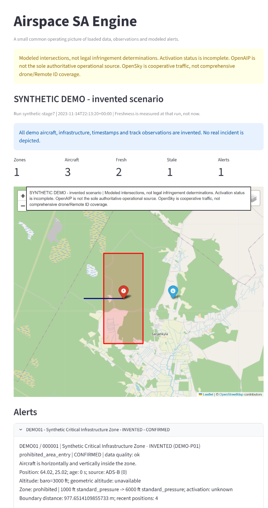
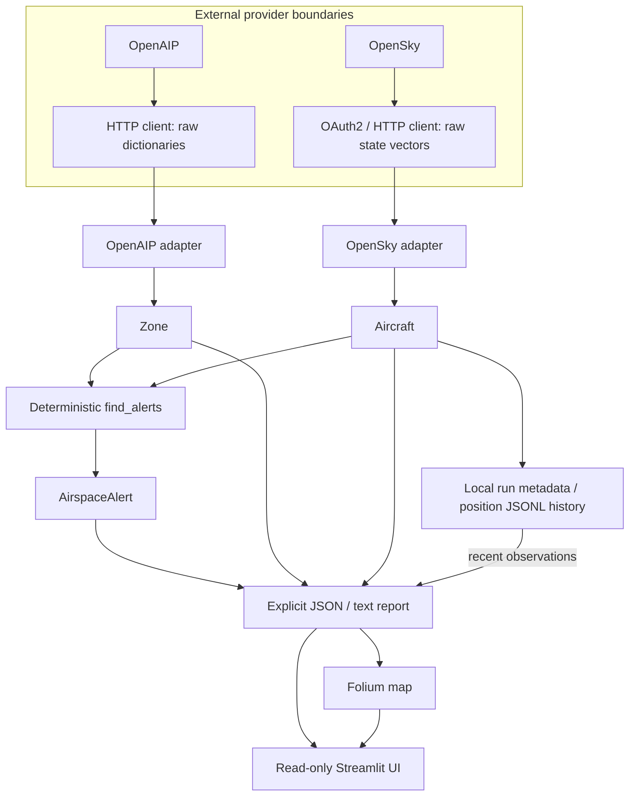

# Airspace SA Engine

[](https://github.com/Anna-akm-code/airspace-sa-engine/actions/workflows/ci.yml)

AIR is a Python portfolio project that turns airspace geometry and aircraft
observations into explainable situational-awareness alerts. It demonstrates
provider integration, deterministic geospatial rules, explicit uncertainty,
and a small shared map of observations and results. It is not operational aviation software.



## What it does

- Ingests paginated OpenAIP airspaces and OAuth2-authenticated OpenSky cooperative observations.
- Detects horizontal and comparable vertical intersections deterministically.
- Preserves UNKNOWN / POTENTIAL / CONFIRMED status and data-quality explanations.
- Shows observation freshness and recent track context from local history.
- Measures distance to airspace boundaries in a Finland-focused metric CRS.
- Produces per-run JSON/text reports, a Folium map and a read-only Streamlit UI.

## Running locally

Use Python **3.14** (locally verified with 3.14.2). From a fresh clone:

```powershell
git clone https://github.com/Anna-akm-code/airspace-sa-engine.git
cd airspace-sa-engine
python -m venv .venv
.venv/Scripts/Activate.ps1
python -m pip install -r requirements.txt
python demo_presentation.py
python -m streamlit run app.py
```

On Linux/macOS, activate with `source .venv/bin/activate` instead.
No API keys, `.env`, previous cache or live data are needed for the synthetic demo
or tests. Declared dependencies are pinned; their transitive dependencies are
resolved by pip, so this is not a fully locked environment.

## Demo

Select **Synthetic Demo** in the UI. Every aircraft, zone, timestamp and track
observation is invented; the real detector produces the example alert. The demo
writes `runs/synthetic-stage7/alerts.json`, `alerts.txt` and `map.html`.
Open the HTML directly for a standalone map. Re-running replaces this demo bundle.
Browser maps normally fetch JavaScript/CSS and OpenStreetMap tiles; artifact
generation and tests need no live aviation APIs.

Optional live development, only with access permitted by [provider terms](DATA_SOURCES.md):
copy `.env.example` to local `.env`, supply your own `OPENAIP_API_KEY`,
`OPENSKY_CLIENT_ID` and `OPENSKY_CLIENT_SECRET`, then run:

```powershell
python detect_only.py
```

Select **Latest saved live run** to inspect that saved bundle. The UI never
fetches traffic. Keep all real observations, reports and cache in ignored `runs/`;
do not publish them. Detailed CLI options and failure policies are in
[development workflows](docs/usage.md) and [live workflow notes](docs/stage5.md).

## Architecture



Workflows compose the layers. Clients return raw data; adapters validate and
convert it to domain models. Detection has no HTTP, tokens or provider enum
knowledge. Reports select JSON-safe fields explicitly; presentation never
recomputes containment. History stores run metadata and positions, while full
alerts and geometry live in report bundles. A replacement provider needs a
client/adapter, not new detection or UI rules.

## Design decisions

See [architecture decisions](docs/decisions.md): alerts are not legal infringement
findings, and danger areas are distinct from prohibited areas. `covers()` includes
horizontal boundary points. Polygon/MultiPolygon geometry preserves holes;
unlimited ceilings are explicit and altitude references remain distinct.

Containment/GeoJSON use EPSG:4326 `(longitude, latitude)`; Folium marker/track
locations use `(latitude, longitude)`. EPSG:3067 is used internally for metre
distances, not display coordinates. Leaflet normally renders its basemap in
EPSG:3857. Removing Streamlit leaves ingestion, detection, history and CLI
reports usable.

## Tests and CI

```powershell
python -m ruff check .
python -m pytest -v
python -m pytest --cov=sa_engine --cov-report=term-missing
```

Tests use synthetic fixtures/fake HTTP and block the real Requests transport.
They also disable dotenv loading and remove provider credentials. Coverage
measures `sa_engine`, not the whole UI/browser experience; it is not a guarantee
of data accuracy or aviation correctness. The known local pytest cache warning
is not a detection failure.

[CI](.github/workflows/ci.yml) runs on pushes and pull requests using Python 3.14
on Ubuntu: install, Ruff, offline pytest/coverage, synthetic demo smoke test.
It requires no repository secrets and performs no deployment. Dependency
installation needs package-registry access. See the
[publication checklist](docs/publication_checklist.md) for verified results and
remaining manual gates; the badge reports GitHub execution, not local success.

## Limitations

- Not certified/operational aviation software, legal infringement determination,
  authoritative flight-planning data or a real-time surveillance service.
- No complete NOTAM processing or reliable activation handling;
  `activation_status` is currently ignored by detection.
- No terrain-aware AGL resolution; GND comparability needs a future domain decision.
- OpenSky cooperative surveillance is not comprehensive drone/Remote ID/U-space coverage.
- OpenAIP is not the sole authoritative operational source. Separate
  [authoritative Finnish comparisons](docs/openaip_manual_check.md) remain pending.
- Saved UI bundles are snapshots: freshness is measured at the run timestamp.
  No alerts does not establish safety; tracks connect observations, not verified routes.
- EPSG:3067 is regional to Finland, with vertex-projected boundary approximations;
  no universal geodesic, dateline or polar accuracy claim is made.
- JSONL is single-writer, not transactional; local reports are trusted application
  artifacts, not an arbitrary-upload service. Large datasets are not optimized.

## Data sources and licensing

[MIT](LICENSE) applies to repository source code owned by Anna. It does not
relicense provider data, APIs, dependencies or map assets. Public examples and
fixtures are synthetic; live OpenSky observations are not distributed.

[Data sources and attribution](DATA_SOURCES.md) separates OpenAIP's data license
from OpenSky's access/publication restrictions, with official sources and the
limits of this review. Recheck these before live use or publishing derived data.

Stage 8 / M2 implementation closes this portfolio milestone. Publication remains
a reviewed manual action; no Stage 9 features or remote publishing are included.
